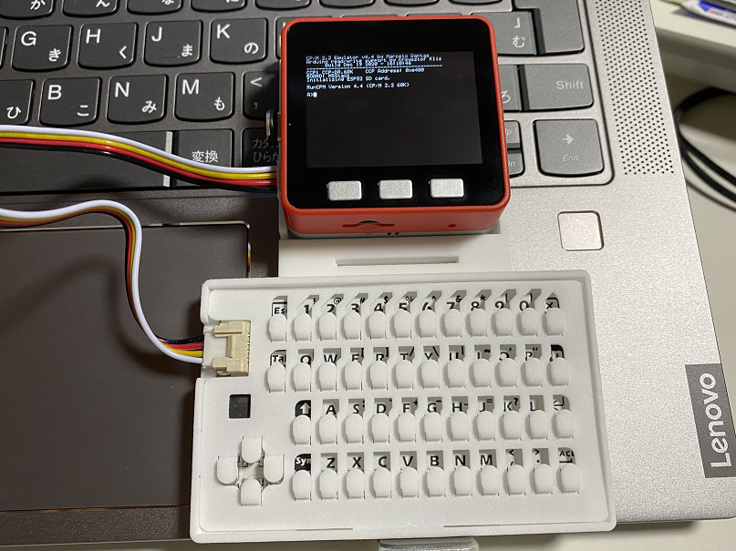

# M5Stack_RunCPM_vt100_CardKB
M5Stackで動く超小型CP/Mマシン

  

"VT100 Terminal Emulator"と"Z80 CP/M 2.2 emulator"を組み合わせた、M5Stackで動く超小型CP/Mマシンです。  
ベースにしたオリジナルはこちら。 
VT100 Terminal Emulator for Arduino STM32 <https://github.com/ht-deko/vt100_stm32> 
RunCPM - Z80 CP/M 2.2 emulator <https://github.com/MockbaTheBorg/RunCPM> 

---

### 必要な物 ###
* [M5Stack](http://www.m5stack.com/ "Title") (Fireで動作確認をしました。) 
* Arduino IDE (1.8.13で動作確認をしました。) 
* [Arduino core for the ESP32](https://github.com/espressif/arduino-esp32 "Title")
* [SDdFatライブラリ](https://github.com/greiman/SdFat "Title") (1.１.4で動作確認をしました。2.x.xではコンパイルエラーになります。)
* [M5Stack用カード型キーボードユニット](https://www.switch-science.com/catalog/5689/ "Title")
* microSD カード
* [Thumb type keyboard frame for M5Stack & CardKB](https://www.thingiverse.com/thing:4392325 "Title") (必要に応じて。）
 

---

### CardKBでの制御文字の入力方法 ###
* Ctrl-C : Fn-C
* Ctrl-H : Fn-H

---

### 参考資料 ###
RunCPM用のディスクの作り方などは、DEKO（@ht_deko）さんのこちらの記事を参照してください。 

* [RunCPM (Z80 CP/M 2.2 エミュレータ)](https://ht-deko.com/arduino/runcpm.html "Title")   

